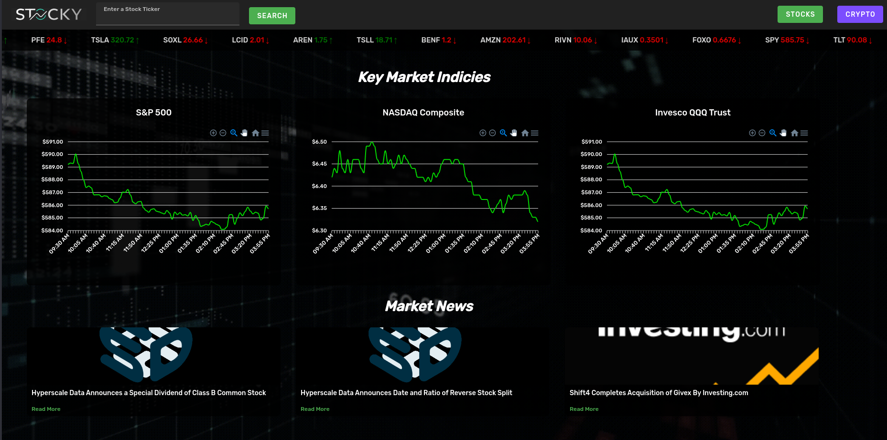

# Stocky - Data Visualisation Web App
Noah Howren \
Last updated: 11/14/2024 \
 \
Stocks Home Page \

Stock View \

Crypto Home Page \

## About the Project
This project was created as a way to depthen my web development experience, specifically as it pertains to data in an easily consumable form packaged as part of an intuitive web application interface.

## The Web Stack
Backend: Flask \
Frontend: Vue.js \
Hosting: None as of yet but may attempt Railway or AWS

## Future Developments
I would like to build out UAC functionality for the app with different tiers of roles, with the main functionality being tied to being able to follow certain stocks and their outcomes. I would also like to incorporate some machine learning modeling on the stocks and crypto data. This is something I have some previous experience with working on (see my "Solar Power Generation" project) but the integration into a Web App interface would be new.

## Acknowledgements
API's Utilized:
- twelvedata.com
- coinranking.com 
- financialmodelingprep.com
- marketaux.com

Background assetts proivided by:
- Stock Market Gif: Bandwidth Maniac - *Stock Market Background Video* - https://www.youtube.com/watch?v=AFicYbv-mzg 
- Crypto Market Gif: Tananchai Dutsadeekun - *World Digital Background Loop* - https://www.youtube.com/watch?v=kWqXMUUcZqc 

## Contact
If you would like to contact me in regards to this project send an email to:
noah@howren.me
